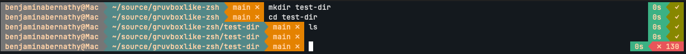

# gruvboxlike-zsh Theme
A minimalist-sort-of Gruvbox-dark powerline theme for oh-my-zsh

## Screen Shot

## Requirements
1. Requires a Nerd Font or Powerline-patched font

## Line Format
- Left : [user@host] > [directory] > [git branch]
- Right: [elapsed] < [exit code]

